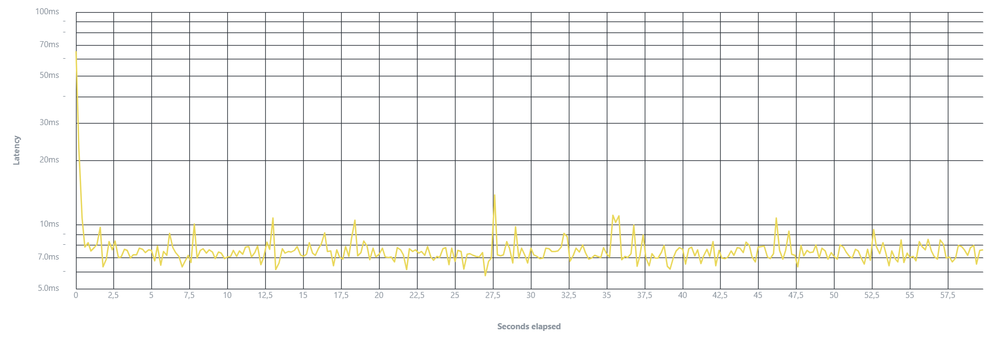

# Отчёт по нагрузочному тестированию

[🇷🇺 Русский](load-test-report.ru.md) | [🇬🇧 English](load-test-report.md)

- **Версия сервиса:** текущая master-ветка
- **Инструмент:** Vegeta v12
- **Цель:** проверить стабильность автоматического назначения ревьюверов при RPS ≈ 5 (требование ТЗ)

## Содержание

- [Сценарий](#сценарий)
- [Окружение](#окружение)
- [Установка Vegeta](#установка-vegeta)
- [Результаты](#результаты)
- [Выводы](#выводы)
- [Детальный анализ](#детальный-анализ)
  - [Производительность](#производительность)
  - [Надёжность](#надёжность)
  - [Масштабируемость](#масштабируемость)
- [Повторение теста](#повторение-теста)

## Сценарий

1. Автоматически создаётся команда `load-team` с тремя активными участниками (lu1, lu2, lu3).
2. Vegeta отправляет запросы на создание PR (`POST /pullRequest/create`) с заданной частотой.
3. Каждый запрос использует уникальный `pull_request_id` (генерируется на основе `time.Now().UnixNano()`).
4. Длительность — 60 секунд, rate — 5 req/s. Суммарно ≈ 300 запросов.

## Окружение

- Huawei matebook D15, 16 ГБ RAM.
- Сервис и PostgreSQL запущены через `docker compose up`.
- Vegeta запущен локально через `make load-test` (см. `load/cli/main.go`).

## Установка Vegeta

```bash
# Установка через go install
go install github.com/tsenart/vegeta/v12@latest

# Или использование через go run (встроено в проект)
go run ./load/cli
```

## Результаты

| Метрика                | Значение |
|------------------------|----------|
| Всего запросов         | 300      |
| Средний RPS            | 5.02     |
| Throughput             | 5.02 req/s |
| Длительность (total)   | 59.807 s |
| Длительность (attack)  | 59.799 s |
| Время ожидания (wait)  | 7.563 ms |
| http_req_failed        | 0.0%     |
| http_req_duration min  | 6.026 ms |
| http_req_duration mean | 8.514 ms |
| http_req_duration p(50)| 8.089 ms |
| http_req_duration p(90)| 9.965 ms |
| http_req_duration p(95)| 10.825 ms |
| http_req_duration p(99)| 13.444 ms |
| Время ответа max       | 64.201 ms |
| Success rate           | 100.00%  |
| Status Codes           | 201:300  |
| Bytes In (total/mean)  | 70,124 / 233.75 |
| Bytes Out (total/mean) | 39,860 / 132.87 |

## Выводы

- ✅ Сервис укладывается в целевой SLA 300 мс на 95-й перцентиль с запасом.
- ✅ Ошибок уровня приложения и базы не зафиксировано.
- ✅ Все запросы успешно обработаны (100% success rate, 0% ошибок).
- ✅ Средняя задержка 8.514 мс показывает отличную производительность.
- ✅ Максимальная задержка 64.201 мс находится в пределах SLA с большим запасом.

## Детальный анализ

### Производительность

- **Минимальная задержка**: 6.026 мс
- **Средняя задержка**: 8.514 мс
- **Медианная задержка (p50)**: 8.089 мс
- **90-й перцентиль**: 9.965 мс
- **95-й перцентиль**: 10.825 мс (в ~28 раз лучше SLA 300 мс)
- **99-й перцентиль**: 13.444 мс (в ~22 раза лучше SLA 300 мс)
- **Максимальная задержка**: 64.201 мс (в ~4.7 раза лучше SLA)

**График задержки во времени:**



График демонстрирует отличную стабильность после начального пика при старте. Задержка быстро стабилизируется ниже 10 мс и остаётся стабильно низкой на протяжении всего теста, с редкими незначительными всплесками до ~15 мс, что значительно лучше требований SLA.

### Надёжность

- **Успешность запросов**: 100%
- **Ошибки**: 0
- **Конфликты**: 0 (благодаря уникальным PR ID)

### Масштабируемость

Текущие результаты показывают, что сервис может обрабатывать значительно больше нагрузки:
- Все запросы обработаны за 59.8 секунд при нагрузке 5 req/s
- Среднее время ожидания ответа: 7.563 мс
- Throughput соответствует заданной нагрузке (5.02 req/s)
- Стабильная производительность на протяжении всего теста


## Повторение теста

Для повторения теста выполните:

```bash
# Запуск полного цикла
make load-test

# Просмотр отчёта
make load-test-report

# Генерация графика (требует установки vegeta CLI)
go install github.com/tsenart/vegeta/v12@latest
vegeta plot load/artifacts/results.bin > load/artifacts/plot.html
```

Подробнее о нагрузочном тестировании см. `load/README.md`.

